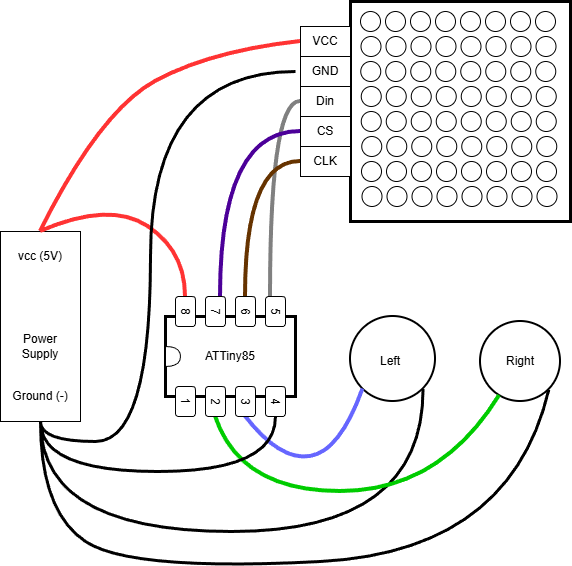
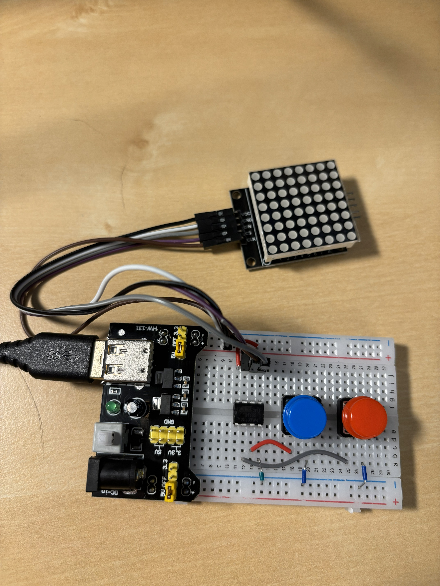

# Building the Game Board

This section covers assembling the DOTris game hardware. The build is intentionally simple, using a breadboard and basic components.

## Parts Needed

- **Breadboard** - Standard size (400 or 830 tie points)
- **Breadboard Power Supply** - 5V output (plugs directly into breadboard)
- **ATtiny85** - DIP-8 package
- **8x8 LED Matrix Module** - With MAX7219 driver (usually comes as a single module)
- **2x Momentary Push Buttons** - For left/right control, optionally with colorful caps
- **Jumper Wires** - A few short pieces for breadboard connections
- **Male-to-Female Jumper Wires** - With Dupont connectors, for connecting to the LED matrix module

## Assembly

### 1. Set Up Power

Insert the breadboard power supply into your breadboard. Make sure it's set to 5V output. The power rails on both sides of the breadboard should now have power available.

### 2. Place the ATtiny85

Insert the ATtiny85 into the breadboard, straddling the center channel. Note the orientation - pin 1 is marked with a small dot or notch on the chip.

Connect power to the ATtiny85:
- Pin 8 (VCC) to the +5V rail
- Pin 4 (GND) to the GND rail

### 3. Connect the LED Matrix Module

The MAX7219 LED matrix module typically has 5 pins: VCC, GND, DIN, CS, and CLK.

Use male-to-female jumper wires with Dupont connectors to connect:

| MAX7219 Module | ATtiny85 Pin | Description |
|----------------|--------------|-------------|
| VCC | +5V rail | Power |
| GND | GND rail | Ground |
| DIN | Pin 5 (PB0) | Data In |
| CLK | Pin 6 (PB1) | Clock |
| CS | Pin 7 (PB2) | Chip Select |

### 4. Add Buttons

The buttons allow you to move the falling pieces left and right. If you don't add buttons, pieces will just fall straight down.

For each button:
- Connect one side to the ATtiny85 pin
- Connect the other side to GND

| Button | ATtiny85 Pin |
|--------|--------------|
| LEFT | Pin 3 (PB4) |
| RIGHT | Pin 2 (PB3) |

The code uses internal pull-up resistors, so no external resistors are needed.

**Tip:** Press both buttons together for a soft drop (faster falling).

## Completed Build

The photo shows the completed build with:
- Breadboard with power supply
- ATtiny85 microcontroller
- MAX7219 8x8 LED matrix module connected via jumper wires
- Two momentary buttons for control

## Testing

1. Make sure your ATtiny85 is already programmed (see [Programming the ATTiny](./section3_programming_the_ATTiny.md))
2. Connect power to the breadboard power supply
3. The LED matrix should light up and the game should start
4. Test the buttons - pieces should move left and right

## Troubleshooting

- **Nothing happens**: Check power connections and that the ATtiny85 is programmed
- **Display shows garbage**: Check DIN, CLK, and CS connections
- **Buttons don't work**: Verify button wiring to correct pins and GND

## Next Steps

Once your board is working, see [Writing the Game](./section6_writing_the_Game.md) to understand how the code works.
